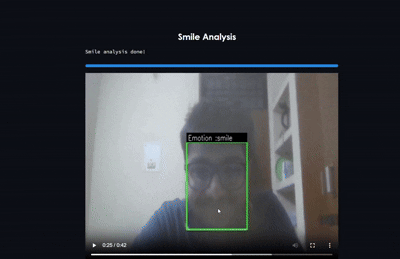

# Virtual Interview Simulator

Virtual Mock Interview Simulator provides a hands-on platform to simulate real interview scenarios, helping candidates prepare for technical and behavioral interviews.

## 📸 Project Demonstration

- **Non Verbal Communication**

  

- **Verbal Communication**

  

## Why This Project?

Interviews are a crucial part of recruitment, but they can be intimidating. Here are some statistics that highlight the importance of preparation:

- **67%** of recruiters consider confidence levels a critical factor in candidate selection, and **39%** of candidates are rejected due to a lack of confidence.
- Maintaining **eye contact** creates a strong impression.
- **92%** of job seekers find mock interviews essential for interview preparation.

Our platform addresses these challenges by offering an interactive, AI-driven simulation experience.

## Features

- **Real-Time Simulations**: Replicates realistic interview scenarios using advanced AI.
- **Dynamic Question Generation**: Generates job-specific questions tailored to the candidate's input (e.g., role, skills, and industry).
- **Voice-Based Interaction**: AI conducts mock interviews, and candidates respond in real time using voice input.
- **Comprehensive Feedback**: Identifies strengths and areas for improvement to enhance interview performance.
- **Advanced Tracking**: Features like face recognition, eye blink detection, and hand gesture tracking for better user insights.

## Technologies Used

- **Frontend**: [Next.js](https://nextjs.org) for a modern, scalable interface.
- **AI/ML**: Mediapipe, OpenCV for interactive features.
- **Speech-to-Text**: Enables real-time voice response processing.

## Getting Started

### Prerequisites

Ensure you have the following installed:

- [Node.js](https://nodejs.org)
- A package manager like `npm`, `yarn`, `pnpm`, or `bun`
- [Python](https://www.python.org) for backend setup
- [PostgreSQL](https://www.postgresql.org) for the database

### Installation

1. Clone the repository:
   ```bash
   git clone https://github.com/tpstark137/Virtual-Interview-Simulator.git
   cd Virtual-Interview-Simulator
   ```

## Getting Started

First, run the development server:

```bash
npm run dev
# or
yarn dev
# or
pnpm dev
# or
bun dev
```

Open [http://localhost:3000](http://localhost:3000) with your browser to see the result.

You can start editing the page by modifying `app/page.js`. The page auto-updates as you edit the file.

This project uses [`next/font`](https://nextjs.org/docs/app/building-your-application/optimizing/fonts) to automatically optimize and load [Geist](https://vercel.com/font), a new font family for Vercel.

## Learn More

To learn more about Next.js, take a look at the following resources:

- [Next.js Documentation](https://nextjs.org/docs) - learn about Next.js features and API.
- [Learn Next.js](https://nextjs.org/learn) - an interactive Next.js tutorial.

You can check out [the Next.js GitHub repository](https://github.com/vercel/next.js) - your feedback and contributions are welcome!

## Deploy on Vercel

The easiest way to deploy your Next.js app is to use the [Vercel Platform](https://vercel.com/new?utm_medium=default-template&filter=next.js&utm_source=create-next-app&utm_campaign=create-next-app-readme) from the creators of Next.js.

Check out our [Next.js deployment documentation](https://nextjs.org/docs/app/building-your-application/deploying) for more details.
